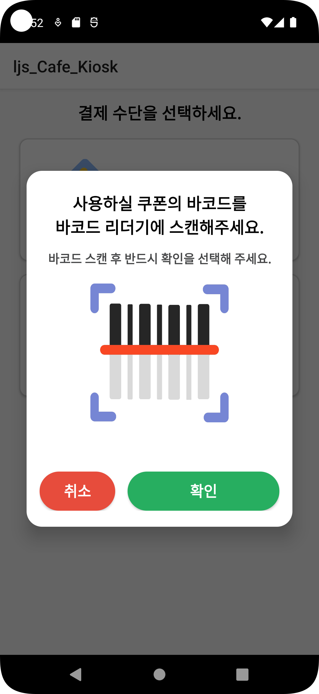
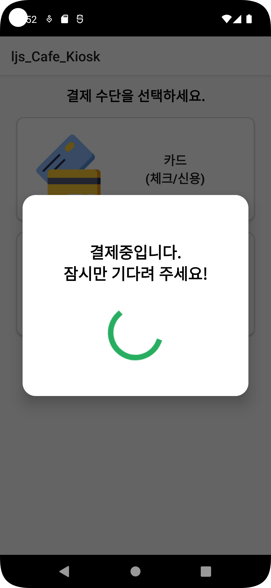

# ☕ 카페 키오스크 앱

> Android Studio를 기반으로 개발한 카페 키오스크 콘셉트의 모바일 애플리케이션입니다. 메뉴 선택부터 장바구니, 결제까지 사용자의 기본적인 주문 흐름을 시뮬레이션하며, 직관적인 UI와 깔끔한 화면 전환을 구현하는 데 중점을 두었습니다.

---

## 📌 프로젝트 개요

- **프로젝트 목적**: 사용자 중심의 UI/UX 흐름 설계 및 Android 앱 컴포넌트 구조 이해
- **개발 기간**: 단기 프로젝트
- **개발 환경**: Android Studio, Java, XML
- **핵심 키워드**: Activity, Fragment, Dialog, ViewPager, TabLayout, RecyclerView

---

## 🛠 기술 스택

| 분야        | 사용 기술 |
|-------------|-----------|
| 언어         | Java |
| IDE         | Android Studio |
| UI 구성     | XML Layout, ViewPager, TabLayout, RecyclerView, Dialog |
| 데이터 구조 | MutableList, Parcelable, 사용자 정의 데이터 클래스 (Menu, OrderHistoryItem) |
| 기능 구현   | 주문 수량 조절, 금액 자동 계산, 결제 흐름 시뮬레이션, 화면 간 전환 처리 |
| 앱 구조     | Activity 3개, Fragment 3개, Dialog 6개 구성 |

---

## 🎨 주요 기능 및 사용자 흐름

### 🧾 메뉴 선택 및 수량 조절
- 탭(TabLayout)으로 메뉴 카테고리(커피/음료/디저트) 구분
- 버튼 클릭 시 수량 증가/감소, 실시간으로 항목별 금액 계산

### 🛒 장바구니 기능
- 현재 선택된 항목을 리스트에 담고 수량 변경/삭제 가능
- 전체 금액 합산을 통해 총 주문 금액 계산

### 💳 결제 화면 흐름
- 결제 버튼 클릭 시 결제 수단 선택 Dialog 표시
- 카드/바코드 결제 선택 후, 결제 완료 Activity로 전환

### 🔄 화면 전환 및 데이터 전달
- Activity 간 Intent 사용, 주문 정보는 Parcelable로 전달
- 전체 화면 흐름: 메뉴 → 장바구니 → 결제 → 완료 화면

---

## 📷 주요 화면 구성

### 🏠 메인 화면 - 메뉴 전체 구조 진입

- 첫 진입 화면으로, 상단 탭을 통해 커피/음료/디저트 카테고리로 이동할 수 있습니다.
- 사용자에게 전체 메뉴를 탐색할 수 있도록 간단하면서 직관적으로 구성하였습니다.

  

### ☕ 메뉴 페이지

- 커피 카테고리에서 원하는 메뉴를 선택할 수 있습니다.
- 메뉴는 스와이프와 터치를 사용하여 화면전환 합니다.
- 각 메뉴는 이미지, 이름, 가격 정보와 함께 구성되어 있으며 수량 조절 버튼이 제공됩니다.

  
  

  
  
  

### 🛒 주문 리스트 / 장바구니 화면

- 선택한 메뉴들이 장바구니 형식으로 나열되며, 수량 변경, 삭제, 전체 가격 확인 기능이 제공됩니다.
- 결제 버튼 클릭 시 다음 결제 화면으로 이동합니다.

  

## 💳 결제 UI 흐름
### 🛒 1. 주문 내역 확인 화면 (Order Summary)

- 사용자가 장바구니에서 [결제] 버튼을 누르면 팝업 형식으로 주문 내역이 표시됩니다.
- 상품명, 수량, 가격이 정리되어 있고 총 결제 금액이 하단에 강조됩니다.
- [취소] 또는 [결제 수단 선택]으로 다음 화면으로 이동 가능합니다.

  

---

### 💳 2. 결제 수단 선택 화면

- 사용자는 카드 결제 또는 쿠폰/교환권 결제를 선택할 수 있습니다.
- 실제 키오스크에서 사용되는 UI 흐름과 동일하게 구성하였습니다.

  

---

### 💳 3. 카드 결제 안내 화면

- 사용자가 카드를 선택하면 실제 카드 삽입을 안내하는 다이얼로그가 뜹니다.
- 카드 삽입 후 [확인]을 눌러야 결제가 진행됩니다.

  

---

### 🧾 4. 쿠폰/교환권 안내 화면

- 디지털 쿠폰 또는 교환권 선택 시, 바코드 스캔을 안내하는 화면이 표시됩니다.
- 바코드 인식 후 [확인] 버튼을 통해 다음 단계로 이동할 수 있습니다.

  

---

### ⏳ 5. 결제 진행중 화면

- 카드 또는 쿠폰 입력 후, '결제 중입니다' 라는 안내 다이얼로그가 잠시 표시됩니다.
- 실제 결제 시스템과 유사한 UX 흐름을 재현한 단계입니다.

  

---
### ⏳ 6. 결제 완료

- 모든 결제가 끝나는 단계입니다.

  

---

## 👩‍💻 담당 역할 및 구현 포인트

- 전체 UI 기획 및 구성, 사용자 흐름에 맞는 화면 설계 주도
- 각 메뉴 화면(Fragment), 결제 다이얼로그(Dialog), Activity 전환 처리 직접 구현
- 주문 내역 관리용 데이터 클래스 설계 및 MutableList로 리스트 상태 유지
- 화면 요소와 데이터의 연동, 버튼 이벤트 처리 및 수량/금액 실시간 계산 구현

---

## 🧠 프로젝트를 통해 배운 점

- 사용자 입장에서의 **UI 구성**과 직관적인 **UX 흐름 설계**의 중요성 체감
- 단순한 기능이라도 명확한 흐름과 시각적 완성도를 통해 **앱의 완성도**를 높일 수 있음을 경험
- Android 컴포넌트 간의 구조적 관계와 데이터 전달 방식에 대한 실전 감각 향상

---

## 📎 참고 사항

- 이 프로젝트는 Firebase나 외부 DB 연동 없이, 기기 내에서 동작하는 로컬 기반 앱으로 개발되었습니다.
- 목적은 **UI 구현 능력 향상**, **앱 구조 이해**, **기본 기능 흐름 설계 역량 강화**에 있습니다.
